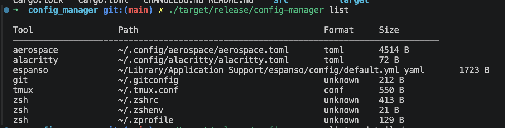

# Config Manager 🔧

Config Manager is a Rust CLI tool for discovering and managing configuration files across macOS, Linux, and Windows systems

## Features

- 🔍 **Auto-discovery**: Finds 25+ common config files across your system
- 📝 **Interactive TUI**: Full-featured terminal UI for browsing and managing configs
- 🔧 **Powerful CLI**: Scriptable commands for automation
- 🎯 **Smart Validation**: Syntax checking for JSON, YAML, TOML, CONF, and Shell files

## Installation

### From Source (macOS, Linux, Windows)
```bash
git clone https://github.com/yourusername/config-manager-cli
cd config-manager
cargo build --release
./target/release/config-manager --help
```

### Requirements
- Rust 1.70+ ([Install Rust](https://rustup.rs))
- macOS (primary target), Linux or Windows

## Quick Start

### 1. Initialize
```bash
config-manager init
```

### 2. Discover Your Configs
```bash
config-manager list
```

### 3. Edit a Config
```bash
config-manager edit zsh
# Launches $EDITOR with your config file
```

## Supported Tools (25+)

| Shells | Editors | Tools | Other |
|--------|---------|-------|-------|
| bash | neovim | git | aerospace |
| fish | vim | ssh | alacritty |
| zsh | | tmux | docker |
| | | kitty | homebrew |
| | | wezterm | node |
| | | | python |
| | | | ruby |
| | | | rust |

_And more! See `config-manager list` for complete list._

## Command Reference

### List Configs
```bash
config-manager list              # All configs
config-manager list --tool git   # Specific tool
config-manager list --detailed   # With timestamps
```

## Result



## Project Architecture

```
config-manager/
├── src/
│   ├── main.rs                      # CLI entry point
│   ├── lib.rs                       # Library exports
│   ├── error.rs                     # Error handling
│   ├── cli.rs                       # Command parser
│   ├── config/                      # Config management
│   │   ├── mod.rs                   # Core types
│   │   ├── config_discovery.rs      # Discovery engine
│   │   ├── config_file.rs           # File abstraction
│   │   ├── config_format.rs         # Format detection
│   │   └── tools/                   # Tool registry
│   │       ├── mod.rs
│   │       ├── tool_registry.rs     # Registry data structure
│   │       └── tools_data.rs        # Tool definitions
│   ├── editor/                      # Editor operations
│   │   ├── mod.rs
│   │   ├── file_config.rs           # Configuration wrapper
│   │   └── file_repository.rs       # File operations
│   ├── handler/                     # Command handlers
│   │   ├── mod.rs
│   │   ├── list_handler.rs          # List command logic
│   │   └── edit_handler.rs          # Edit command logic
└── Cargo.toml                       # Manifest
```

## Development

Build the project:
```bash
cargo build
cargo build --release
```

Run with arguments:
```bash
cargo run -- list
cargo run -- edit zsh --code
```

## Security

- No external API calls
- All data stored locally
- File permissions preserved
- Atomic writes prevent corruption

## License

MIT License - See LICENSE file for details

---

**Made with ❤️ in Rust**
